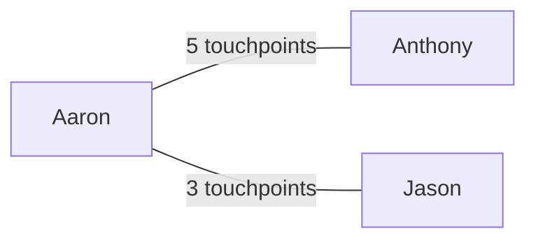

# Weekly Wrap

Generate a comprehensive weekly progress report.

## Usage

```
/weekly-wrap              # Current week (Mon–today)
/weekly-wrap Mar 7        # Week of March 7 (Mon–Fri)
/weekly-wrap 2026-02-24   # Week of Feb 24
```

## Step 1: Date Handling

Parse `$ARGUMENTS` to determine the target week:

- **No argument**: Current week. Start = most recent Monday, End = today.
- **Date argument** (e.g., `Mar 7`, `2026-03-07`, `March 7`): Find the Monday of the week containing that date. Start = that Monday, End = the following Sunday (or today if it's the current week).

Compute these values before launching agents:
- `START_DATE` — YYYY-MM-DD (Monday)
- `END_DATE` — YYYY-MM-DD (Friday or today)
- `END_DATE_PLUS_1` — YYYY-MM-DD (day after END_DATE, for exclusive `--before`)
- `BUCKET` — absolute path to `config.output_dir/data-START_DATE` (expand `~` to `$HOME`, no tildes in agent prompts)

## Step 1.5: Data Bucket

All agent outputs go to `BUCKET/`. Agents use the **Write tool** to create bucket files — Write auto-creates directories, no permissions needed. The synthesizer uses the **Read tool** to access these files.

## Subagent Rules

**CRITICAL: Include these rules in EVERY subagent prompt.** Subagents do NOT inherit the parent's CLAUDE.md, settings, or permissions.

```
RULES — follow these exactly:
1. Do NOT write Python scripts. Use only Bash and the tools listed below.
2. Do NOT run mkdir, pip, brew, or any package installation commands.
3. Do NOT modify any files outside your designated bucket file.
4. Do NOT modify settings, configs, or .claude files.
5. Use the Write tool to create your bucket file (it auto-creates directories).
6. Use the Read tool to read files.
7. Only run the specific Bash commands listed in your instructions.
8. Return a brief summary — the full data goes in the bucket file.
```

## Step 2: Launch Data-Gathering Agents in Parallel

Launch **all 9 sonnet subagents simultaneously** in a single message. Each agent is research-only. Pass `START_DATE`, `END_DATE`, `END_DATE_PLUS_1`, and `BUCKET` (absolute path) explicitly.

**Each agent MUST write its full output to its bucket file** using the Write tool, then return only a brief summary.

### Key Constants (from `~/.claude/skills/weekly-wrap/config.json`)

Before launching agents, read `~/.claude/skills/weekly-wrap/config.json` and extract:
- **GitHub username**: `config.github.username`
- **GitHub orgs**: `config.github.orgs[]`
- **Jira projects**: `config.jira.projects[]`

Pass these values into each agent prompt by substituting the placeholders below:
- `{{GITHUB_USERNAME}}` → `config.github.username`
- `{{GITHUB_ORG}}` → run commands once per org in `config.github.orgs[]`
- `{{JIRA_PROJECT}}` → run commands once per project in `config.jira.projects[]`
- `BUCKET` → `config.output_dir` expanded to absolute path + `/data-START_DATE`

---

### Agent 1: GitHub PRs (sonnet)

**Bucket file**: `BUCKET/01-github-prs.md`

Run these for EACH org in `config.github.orgs[]`, deduplicate by `html_url`, group by repo, note state (open/merged/closed). Write full results to bucket file via Write tool.

```bash
# PRs created in range
gh api search/issues --method GET --paginate -f q="author:{{GITHUB_USERNAME}} type:pr org:{{GITHUB_ORG}} created:START_DATE..END_DATE" -f per_page=100 --jq '.items[] | {title, html_url, state, created_at, closed_at, merged_at: .pull_request.merged_at, repo: .repository_url}'

# PRs merged in range (catches pre-range PRs that merged this week)
gh api search/issues --method GET --paginate -f q="author:{{GITHUB_USERNAME}} type:pr org:{{GITHUB_ORG}} merged:START_DATE..END_DATE" -f per_page=100 --jq '.items[] | {title, html_url, state, created_at, closed_at, merged_at: .pull_request.merged_at, repo: .repository_url}'
```

---

### Agent 2: GitHub Reviews & Comments (sonnet)

**Bucket file**: `BUCKET/02-github-reviews.md`

Run these 2 `gh` commands for EACH org in `config.github.orgs[]`, deduplicate by `html_url`, group by repo. Write full results to bucket file via Write tool.

```bash
gh api search/issues --method GET --paginate -f q="reviewed-by:{{GITHUB_USERNAME}} type:pr org:{{GITHUB_ORG}} -author:{{GITHUB_USERNAME}} updated:START_DATE..END_DATE" -f per_page=100 --jq '.items[] | {title, html_url, state, repo: .repository_url}'

gh api search/issues --method GET --paginate -f q="commenter:{{GITHUB_USERNAME}} org:{{GITHUB_ORG}} updated:START_DATE..END_DATE -author:{{GITHUB_USERNAME}}" -f per_page=100 --jq '.items[] | {title, html_url, state, repo: .repository_url}'
```

---

### Agent 3: Jira Activity (sonnet)

**Bucket file**: `BUCKET/03-jira.md`

Run these 3 `acli` commands for EACH project in `config.jira.projects[]` (skip any that fail), deduplicate by issue key, flag status-changed items as "transitioned". Write full results to bucket file via Write tool.

```bash
acli jira workitem search --jql "project = {{JIRA_PROJECT}} AND assignee = currentUser() AND updated >= 'START_DATE' AND updated <= 'END_DATE' ORDER BY updated DESC" --fields "key,summary,status,priority" --json --limit 50

acli jira workitem search --jql "project = {{JIRA_PROJECT}} AND assignee = currentUser() AND status changed DURING ('START_DATE', 'END_DATE') ORDER BY updated DESC" --fields "key,summary,status,priority" --json --limit 50

acli jira workitem search --jql "project = {{JIRA_PROJECT}} AND (assignee = currentUser() OR reporter = currentUser()) AND updated >= 'START_DATE' ORDER BY updated DESC" --fields "key,summary,status,priority" --json --limit 50
```

---

### Agent 4: Claude Session History & Git Logs (sonnet)

**Bucket file**: `BUCKET/04-session-history.md`

Run this single command, write full output to bucket file via Write tool:

```bash
bash ~/.claude/skills/weekly-wrap/session-history.sh START_DATE END_DATE_PLUS_1
```

---

### Agent 5: Calendar (sonnet)

**Bucket file**: `BUCKET/05-calendar.md`

**STRICT: ONLY call `mcp__claude_ai_Google_Calendar__gcal_list_events` and Write tool. No other tools.**

**Query ONE DAY AT A TIME** (5 calls, Mon–Fri):

```
mcp__claude_ai_Google_Calendar__gcal_list_events(
  timeMin="YYYY-MM-DDT00:00:00",
  timeMax="YYYY-MM-DDT23:59:59",
  maxResults=50,
  condenseEventDetails=true
)
```

Filter each day's results:
- ONLY include events where myResponseStatus is "accepted" or "tentative"
- EXCLUDE declined, needsAction, null response events
- EXCLUDE personal events (🏠 prefixed, single-attendee non-work items)
- EXCLUDE all-day markers (Home), focus blocks, lunch blocks, afternoon catch-up blocks

Write filtered summary (grouped by day, with 1:1 names, meeting counts) to bucket file via Write tool.

---

### Agent 6: Granola Meeting Notes (sonnet)

**Bucket file**: `BUCKET/06-granola.md`

Run this single command, write full output to bucket file via Write tool:

```bash
bun ~/.claude/skills/weekly-wrap/granola.ts START_DATE END_DATE
```

---

### Agent 7: Linear Activity (sonnet)

**Bucket file**: `BUCKET/07-linear.md`

Call `mcp__linear__list_issues(assignee="me", updatedAt="START_DATE", limit=100, orderBy="updatedAt")`. Write results to bucket file via Write tool. Empty results are fine.

---

### Agent 8: Notion Activity (sonnet)

**Bucket file**: `BUCKET/08-notion.md`

Search Notion for pages created/edited during the week. Make 2-3 search calls with different queries:

```
mcp__notion-server__notion-search(query="spec design doc RFC", query_type="internal", filters={created_date_range: {start_date: "START_DATE", end_date: "END_DATE"}}, page_size=25, max_highlight_length=200)

mcp__notion-server__notion-search(query="meeting notes proposal review", query_type="internal", filters={created_date_range: {start_date: "START_DATE", end_date: "END_DATE"}}, page_size=25, max_highlight_length=200)
```

For the top 3-5 most relevant results, fetch comments using `mcp__notion-server__notion-get-comments(page_id="...", include_all_blocks=true)` to capture discussion threads.

Write results to bucket file via Write tool. Note: results may include pages by others — only include pages that the user authored or edited. If unclear, include with `[?]`.

---

### Agent 9: Slack Activity (sonnet)

**Bucket file**: `BUCKET/09-slack.md`

Run this single command:

```bash
bun ~/.claude/skills/weekly-wrap/slack.ts START_DATE END_DATE_PLUS_1
```

Summarize the output (do NOT dump raw messages). Write summary to bucket file via Write tool:
- Most active channels and topics
- Key decisions or announcements
- Notable DM threads by topic (not content)
- Skip personal/social messages

---

## Content Guardrails

**This report is a professional work summary.** All agents and the synthesizer MUST follow these rules:

1. **Work-only content.** Exclude personal calendar events, personal messages, non-work content.
2. **When in doubt, leave it out.** Flag borderline items with `[?]`.
3. **No fabrication.** Only report what is directly evidenced in the data.
4. **Names = first and last names** (e.g., "Anthony Hernandez" not email addresses). Summarize attendee lists, don't dump raw.

---

## Step 3: Synthesize with Opus Agent

After ALL agents return, launch a single **opus agent**. It should:
1. Read each bucket file (`01-github-prs.md` through `09-slack.md`) using the Read tool
2. Apply the Content Guardrails
3. Flag uncertain items with `[?]`
4. Write its draft to `BUCKET/draft.md` using the Write tool

### Output Structure

```markdown
# Weekly Wrap: [Mon date] – [End date]

## High-Level Summary
> 2-4 sentence narrative of highlights and themes.

## Project Activity
### [Project/Repo Name]
- **PRs**: list with status and links
- **Reviews**: PRs reviewed with links
- **Jira/Linear**: related tickets with status
- _Brief narrative_
_(repeat per project)_

## Code Reviews & Collaboration
- PRs reviewed for others (grouped by repo, with links)

## Research & Exploration
- Topics explored, tools investigated, docs written

## Jira / Linear Summary
- Tickets progressed, created, commented on

## Calendar & Meetings
- Key meetings grouped by theme or day
- 1:1s, planning, syncs

## People
> Who did I spend the most time with this week?

Ranked interaction table from ALL sources (calendar, Slack, GitHub, Granola, Jira). Include a Mermaid diagram:

Top ~10 people by interaction volume.

## Week at a Glance
Unicode bar charts and emoji heatmaps. Be creative and fun:
```
📊 PRs:     ████████████████████████ 44 merged | 3 open
👀 Reviews:  ████████████████████ 36
📅 Meetings: ██████████ 18
💬 Slack:    ██████████████████████████ 500 msgs
```
Day-by-day activity heatmap with colored dots.

## Slack Highlights
- Key themes, incidents, decisions, announcements

## Daily Breakdown
### Monday [date]
- Key activities
_(repeat per weekday)_

## Lessons Learned
### Start
> New practices worth adopting (grounded in evidence)
### Stop
> Friction points, anti-patterns observed
### Continue
> Things going well — keep doing them

## Open Threads
> Items in progress at week's end.

---

## Vibe Check
Pick ONE random question and answer based on the week's actual vibe:
- "If this week were a dog breed?" / "Movie title?" / "Cocktail?" / "Weather forecast?"
- "Olympic sport?" / "Kitchen appliance?" / "Mario Kart item?" / "Board game?"
- "Yelp review?" / "Coffee order?" / "Font?" / "D&D class?" / "Sandwich?"
- "Song soundtrack?" / "National park?" / "Reality TV show?" / "Postcard message?"
Keep it witty and grounded.
```

### Synthesis Guidelines
- **Lead with themes, not lists.** High-Level Summary and project narratives read like a brief written by a human.
- Each project section: 1-2 sentence narrative before bullets.
- Daily Breakdown: punchier/bullet-style.
- Deduplicate across sources. Use markdown links. Assign to days via timestamps.
- Factual but not robotic — write like a thoughtful colleague.
- Do NOT invent activity. First and last names (no emails).
- **People section**: Cross-reference ALL sources. Mermaid diagram.
- **Week at a Glance**: Creative Unicode charts. Fun to look at.
- **Lessons Learned**: Ground in evidence. Slack tone, Claude session patterns.
- Filter personal/non-work items. Mark uncertain with `[?]`.

---

## Step 4: Output

Read `BUCKET/draft.md` and write it to `~/weekly-wraps/wrap-START_DATE.md` using the Write tool. Display the report in the conversation. Open it: `zed ~/weekly-wraps/wrap-START_DATE.md`

## Important Notes

- All 9 gathering agents MUST launch in a single message (parallel)
- Include the Subagent Rules block in EVERY agent prompt
- Use absolute paths (no `~`) in agent prompts — expand `~` to `$HOME`
- Opus synthesizer runs AFTER all agents return
- If any agent fails, note it in the report and continue
- Historical weeks may have less data — that's expected
